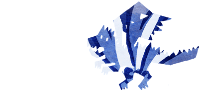

# Rukavychka (Рукавичка)



Find the mouse (with dragon) and the door to Rukavychka (with fox) together, then lead the mouse to the door.

The mouse can walk only on the plants within the fox or the dragon and will stop in front of gaps.

The dragon and the fox are in 2 different worlds, but in the end everyone will be joined together.

[Play now on itch.io!](https://holypangolin.itch.io/rukavychka)

## Controls

Keyboard: **WSAD** (Ukrainian fox) & **ARROWS** (Polish Wawel dragon); or touchscreen.

## Inspiration & meaning

The game was inspired by Ukrainian legend of Rukavychka (glove) - in which an old man lost a glove, which came to be a home for many forest animals big and small: from a little mouse to a huge bear. In the story, the old man takes the glove back, but we imagine a story where the animals can live safely in the magical home. They are lost and we have to lead them to it by a fox from the Ukrainian story, and Wawel Dragon from Polish legends, to unify our nations by social cooperation, and unfold/bring safe future for everyone (including forest beings that also need peace to exist).

We developed the first level, in which you lead a little mouse to magical rukavychka.

We were inspired by traditional floral patterns for the backgrounds (made by watercolors and ink). We also focused on colors from Ukrainian flag (yellow and blue shades, with a bit of green for the leaves) and important Ukrainian flowers like sunflower or Vinca species.

## Cloning the repository

As Rukavychka uses git submodules, make sure to initialize them before trying to compile:

```
git clone https://gitlab.com/HolyPangolin/rukavychka --recursive
```

## Compiling

### Natively on GNU/Linux

You need a complete set of *Allegro 5* libraries, *CMake* and, of course, a C/C++ compiler installed. *Ninja* build system is optional, but recommended. On Debian-based distributions (Ubuntu, PureOS, ...), you can install all dependencies by issuing:

```
sudo apt install build-essential cmake ninja-build git liballegro5-dev liballegro-acodec5-dev liballegro-audio5-dev liballegro-image5-dev liballegro-ttf5-dev liballegro-video5-dev
```

On Arch:

```
pacman -S --needed base-devel cmake allegro ninja git
```

To build Rukavychka:

```
mkdir build
cd build
cmake .. -GNinja
ninja
```

Now you can run the game by calling:

```
src/rukavychka
```

### Using Flatpak

You need to have *flatpak-builder* installed.

To build and install Rukavychka:

```
flatpak-builder build-flatpak flatpak/com.holypangolin.Rukavychka.json --force-clean --install --user
```

To run Rukavychka after building the flatpak, issue this command:

```
flatpak run com.holypangolin.Rukavychka
```

The game depends on the Freedesktop SDK 21.08. If Flatpak doesn't offer to install it automatically when building, make sure you have some repository that contains it enabled, for instance Flathub:

```
flatpak remote-add --if-not-exists flathub https://flathub.org/repo/flathub.flatpakrepo
```

**Note**: Flatpak builds configure Allegro to use SDL2 backend, which gives them native Wayland support.

### Using Docker SDK

You can cross-compile Rukavychka to a bunch of various platforms using libsuperderpy's Docker SDK. To do so, you can run various `package_*.sh` scripts from the `utils/` directory (do `git clone https://gitlab.com/dosowisko.net/libsuperderpy-utils utils` first if you use the tarball). The resulting packages will be placed into `utils/output/`. For more information, consult the [utils/README](https://gitlab.com/dosowisko.net/libsuperderpy-utils/blob/master/README) file.

## Compilation options

You can pass some variables to CMake in order to configure the way in which Rukavychka will be built:

|Variable|Meaning|
|--------|-------|
|`BUILD_SHARED_LIBS` | enabled by default; implies `LIBSUPERDERPY_STATIC`, `LIBSUPERDERPY_STATIC_COMMON` and `LIBSUPERDERPY_STATIC_GAMESTATES` when disabled |
|`LIBSUPERDERPY_STATIC` | links the libsuperderpy engine as a static library |
|`LIBSUPERDERPY_STATIC_COMMON` | links the common Rukavychka routines as a static library |
|`LIBSUPERDERPY_STATIC_GAMESTATES` | links the gamestates as static libraries |
|`LIBSUPERDERPY_EMBEDDED_ALLEGRO` | uses an embedded copy of Allegro and links it in statically |
|`LIBSUPERDERPY_STATIC_DEPS` | tries to link system Allegro in statically |
|`LIBSUPERDERPY_EXTRA_LIBS` | extra set of libraries to link resulting binaries with |
|`LIBSUPERDERPY_LTO` | enables link-time optimizations |
|`USE_CLANG_TIDY` | when enabled, uses clang-tidy for static analyzer warnings when compiling. |
|`SANITIZERS` | enables one or more kinds of compiler instrumentation: address, undefined, leak, thread |

Example: `cmake .. -GNinja -DLIBSUPERDERPY_LTO=ON`

### Packaging notes

Since libsuperderpy doesn't have a stable ABI yet, it's recommended to compile with `-DLIBSUPERDERPY_STATIC=ON` option for packaging to not clash with other libsuperderpy-based games.

Allegro doesn't have native Wayland backend - it does have SDL2 one though, which in turn can use Wayland. However, it needs to be enabled at compile time. Therefore, when targetting Wayland-based platforms, it's recommended to use `-DLIBSUPERDERPY_EMBEDDED_ALLEGRO=ON -DALLEGRO_SDL=ON` options (unless Allegro compiled with SDL2 backend is already provided by the platform).

When using Allegro's SDL2 backend for its Wayland support, it's recommended to use SDL2 2.0.10 or newer. Also, remember that SDL2 still defaults to X11 backend, so make sure the `SDL_VIDEODRIVER=wayland` environment variable is set.

With `LIBSUPERDERPY_EMBEDDED_ALLEGRO` enabled, make sure to provide all dependencies required by Allegro. On Debian-based systems that will be:

```
sudo apt install build-essential cmake ninja-build git pkg-config libogg-dev libfreetype6-dev libphysfs-dev libvorbis-dev libopus-dev libtheora-dev libflac-dev libopenal-dev libwebp-dev libpng-dev libjpeg-dev libdumb1-dev libopusfile-dev

sudo apt install libsdl2-dev # when using SDL backend
sudo apt install libx11-dev libxcursor-dev libxrandr-dev libxi-dev libpulse-dev libasound2-dev libxpm-dev libice-dev libsm-dev libxext-dev libxinerama-dev # when using X11 backend
sudo apt install libgl1-mesa-dev libglu1-mesa-dev # for OpenGL on X11
sudo apt install libgles2-mesa-dev # for OpenGL ES on X11
```

## License

The game's source code is available under the terms of [GNU General Public License 3.0](COPYING) or later.

The game's art assets are available under the terms of [CC BY-NC-SA 4.0](https://creativecommons.org/licenses/by-nc-sa/4.0/).

## Contributing

Rukavychka uses the libsuperderpy's code style guide: [libsuperderpy/README_codestyle.md](https://gitlab.com/dosowisko.net/libsuperderpy/blob/master/README_codestyle.md).

## Made by

Agata Nawrot and Sebastian Krzyszkowiak for *United with Ukraine Game Jam 2022*.
